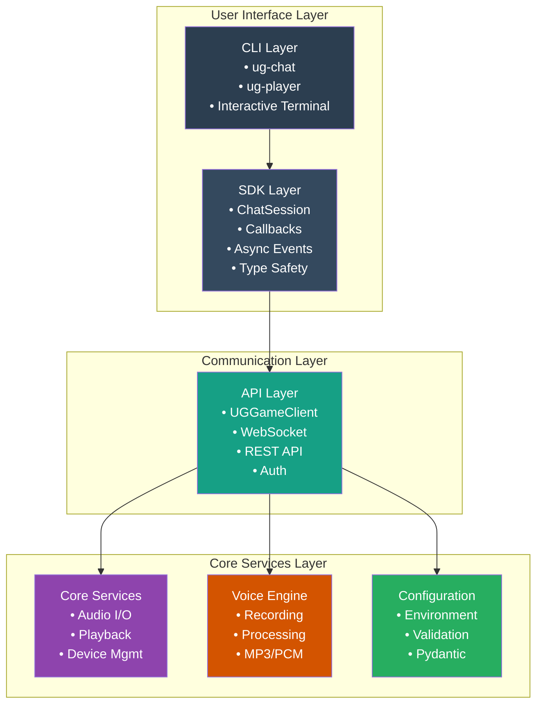
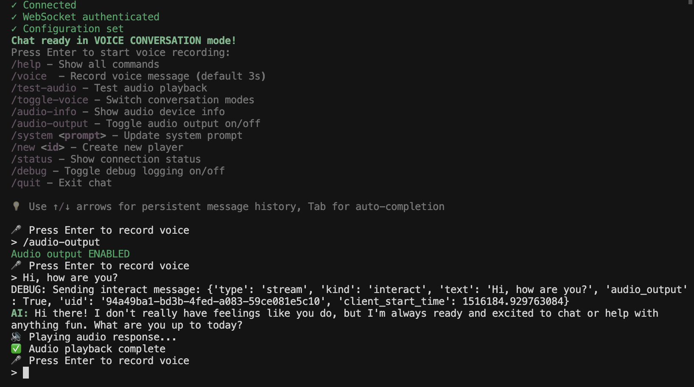
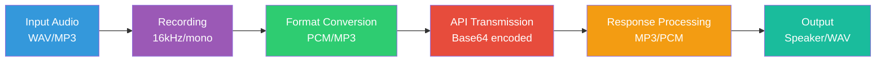

# UG Game - SDK & Chat Interface for UG Labs PUG API

A comprehensive, production-ready SDK and chat interface for interacting with the UG Labs PUG API through text and voice conversations. Built with modern Python async patterns, rich CLI interfaces, and full WebSocket integration.

## 🏗️ High-Level Architecture

### System Design



### Key Components

- **CLI Layer**: Interactive terminal interfaces with rich formatting and command handling
- **SDK Layer**: Programmatic API with callbacks and async event handling
- **API Layer**: Low-level WebSocket and REST client with authentication
- **Core Services**: Audio processing, configuration management, and utilities

## 📁 Project Structure

```
ug-game/
├── src/ug_game/
│   ├── __init__.py              # Package exports (UGGameClient, settings)
│   ├── api/
│   │   ├── __init__.py
│   │   └── client.py            # WebSocket + REST API client (92% test coverage)
│   ├── cli/
│   │   ├── __init__.py
│   │   ├── chat.py              # Interactive chat interface (0% coverage)
│   │   └── player.py            # Player management CLI (98% coverage)
│   ├── core/
│   │   ├── __init__.py
│   │   ├── config.py            # Pydantic settings management (100% coverage)
│   │   └── voice.py             # Audio recording/playback (72% coverage)
│   └── sdk/
│       ├── __init__.py
│       ├── session.py           # High-level SDK interface (70% coverage)
│       └── types.py             # Type definitions & callbacks (73% coverage)
├── tests/                       # 87 comprehensive tests (46% coverage)
├── scripts/                     # Utility scripts (demo, create_player, etc.)
├── pyproject.toml               # Modern Python packaging with uv
├── uv.lock                      # Dependency lock file
├── run_chat.py                  # Main CLI entry point
└── README.md
```

## 🚀 Installation & Setup

### Prerequisites

- Python 3.8+
- FFmpeg (for MP3 audio processing)
- Microphone/speakers (for voice features)
- UG Labs API credentials

### Quick Start

1. **Install dependencies**:
   ```bash
   uv sync
   ```

2. **Configure environment**:
   ```bash
   # Create .env file with your API credentials
   cat > .env << EOF
   # Developer API key (from https://pug-playground.stg.uglabs.app/profile)
   DEVELOPER_API_KEY=your-developer-api-key-here

   # Service account API key (from https://pug-playground.stg.uglabs.app/service-accounts)
   SERVICE_ACCOUNT_API_KEY=your-service-account-api-key-here

   # Optional: Specific player ID (can be created via /new command)
   PLAYER_FEDERATED_ID=your-player-federated-id-here
   EOF
   ```

3. **Start chatting**:
   ```bash
   python run_chat.py
   ```

## 💬 Using the Chat Interface (`run_chat.py`)

The interactive chat interface provides a rich terminal experience with voice and text capabilities.

### Starting the Chat

```bash
python run_chat.py
```



**What happens on startup:**
1. Authenticates with UG Labs API using your credentials
2. Establishes WebSocket connection for real-time chat
3. Sets up audio devices and voice processing
4. Displays available commands and mode status

### Chat Modes

- **Voice Conversation Mode** (default): Press Enter to record voice, AI responds with text + optional audio
- **Text Chat Mode**: Type messages directly, receive text responses

### Essential Commands

| Command | Description | Example |
|---------|-------------|---------|
| `/help` | Show all available commands | `/help` |
| `/quit` \| `/exit` | Exit the chat session | `/quit` |
| `/voice [sec]` | Record voice message (default 3s) | `/voice 5` |
| `/toggle-voice` | Switch between voice/text modes | `/toggle-voice` |
| `/audio-output` | Toggle audio output on/off | `/audio-output` |
| `/test-audio` | Test audio playback with sample | `/test-audio` |
| `/audio-info` | Show audio device information | `/audio-info` |
| `/system <prompt>` | Update AI system prompt | `/system You are a pirate AI.` |
| `/new <id>` | Create new player account | `/new user@example.com` |
| `/status` | Show connection and mode status | `/status` |
| `/debug` | Toggle debug logging | `/debug` |
| `/history` | Show message history | `/history` |
| `/clear` | Clear message history | `/clear` |

### Voice Mode Controls

- **Enter**: Start voice recording (default 3 seconds)
- **↑/↓**: Navigate message history
- **Tab**: Auto-complete commands
- **Ctrl+C**: Interrupt current operation

### Example Session

```
🎪 UG Game Chat Interface v0.1.0
─────────────────────────────────────

[green]Authenticating...[/green]
[green]✓ Authentication successful[/green]
[green]Connecting to chat service...[/green]
[green]✓ Connected[/green]
[green]✓ WebSocket authenticated[/green]
[green]✓ Configuration set[/green]

[bold green]Chat ready in VOICE CONVERSATION mode![/bold green]
[dim]Press Enter to start voice recording:[/dim]
[dim]/help - Show all commands[/dim]

> /system You are a helpful coding assistant.
[dim]System prompt updated[/dim]

> What is async/await in Python?
[dim]Recording 3s audio...[/dim]
[dim]Transcribing...[/dim]
[dim]AI: Async/await in Python allows you to write asynchronous code...[/dim]
[dim](Audio response ready - press Enter to play)[/dim]

>
```

## 👤 Player Management

### Creating Players

```bash
# Using the CLI
python -m ug_game.cli.player create --external-id "user@example.com"

# Or in chat with /new command
> /new user@example.com
```

### Player API Keys

Each player gets:
- **Federated ID**: Unique identifier for chat sessions
- **External ID**: Human-readable identifier (email, username, etc.)
- **API Credentials**: For authentication

## 🛠️ SDK Overview & Usage

The SDK provides programmatic access to UG Game chat functionality with async callbacks and type safety.

### Core Classes

- **`ChatSession`**: Main SDK interface with async event handling
- **`ChatCallbacks`**: Event handlers for responses, errors, and status updates
- **`ChatConfig`**: Configuration options for sessions
- **`ChatResponse`**: Response data container with text/audio/error states

### Basic SDK Usage

```python
import asyncio
from ug_game.sdk.session import ChatSession
from ug_game.sdk.types import ChatCallbacks, ChatConfig

async def main():
    # Set up event callbacks
callbacks = ChatCallbacks(
        on_text_response=lambda text: print(f"🤖 {text}"),
        on_audio_response=lambda audio: print(f"🔊 Audio: {len(audio)} bytes"),
        on_error=lambda error: print(f"❌ Error: {error}"),
        on_status_change=lambda status: print(f"📊 {status}")
    )

    # Configure session
    config = ChatConfig(
        debug_mode=True,
        audio_output=True,
        sample_rate=16000
    )

    # Create and initialize session
session = ChatSession(callbacks=callbacks, config=config)
await session.initialize(
        service_account_api_key="your-service-key",
    player_federated_id="your-player-id",
    system_prompt="You are a helpful assistant."
)

    # Send messages
    response = await session.send_text("Hello, world!")
print(f"Response: {response.text}")

    # Voice interaction
    voice_response = await session.record_and_send_voice(duration_seconds=3)

    # Update system prompt
    await session.update_system_prompt("You are now a pirate!")

    # Clean up
await session.disconnect()

# Run the example
asyncio.run(main())
```

### Advanced SDK Features

#### Custom Callbacks

```python
from ug_game.sdk.types import ChatCallbacks

class MyChatHandler:
    def __init__(self):
        self.message_count = 0

    def on_text_response(self, text: str):
        self.message_count += 1
        print(f"Message {self.message_count}: {text}")

    def on_audio_response(self, audio: bytes):
        # Save audio to file
        with open(f"response_{self.message_count}.wav", "wb") as f:
            f.write(audio)

    def on_error(self, error: Exception):
        print(f"Chat error: {error}")

    def on_status_change(self, status: str):
        print(f"Status: {status}")

# Use with session
handler = MyChatHandler()
callbacks = ChatCallbacks(
    on_text_response=handler.on_text_response,
    on_audio_response=handler.on_audio_response,
    on_error=handler.on_error,
    on_status_change=handler.on_status_change
)
```

#### Voice Integration

```python
# Record and send voice message
response = await session.record_and_send_voice(
    duration_seconds=5,  # Record for 5 seconds
    auto_play=True       # Auto-play AI response
)

# Send pre-recorded audio
with open("my_message.wav", "rb") as f:
    audio_data = f.read()

response = await session.send_voice(audio_data)
```

#### Configuration Options

```python
from ug_game.sdk.types import ChatConfig

config = ChatConfig(
    # API endpoints (override defaults)
    api_base_url="https://custom-api.example.com",
    websocket_url="wss://custom-ws.example.com",

    # Audio settings
    audio_output=True,      # Enable audio responses
    sample_rate=16000,      # Audio sample rate
    language_code="en",     # Speech language

    # Debug and logging
    debug_mode=True         # Enable debug output
)
```

### SDK Error Handling

```python
try:
    await session.initialize(
        service_account_api_key="invalid-key",
        player_federated_id="user-123"
    )
except UGGameAPIError as e:
    if "authentication" in str(e).lower():
        print("Invalid API credentials")
    elif "connection" in str(e).lower():
        print("Network connection failed")
    else:
        print(f"API error: {e}")
```

### Integration Examples

#### Web Application Integration

```python
from ug_game.sdk.session import ChatSession
from ug_game.sdk.types import ChatCallbacks

class WebSocketChatBridge:
    def __init__(self, websocket_connection):
        self.ws = websocket_connection
        self.session = None

    async def initialize(self):
        callbacks = ChatCallbacks(
            on_text_response=lambda text: self.ws.send_json({"type": "text", "content": text}),
            on_audio_response=lambda audio: self.ws.send_json({"type": "audio", "data": base64.b64encode(audio).decode()}),
            on_error=lambda error: self.ws.send_json({"type": "error", "message": str(error)}),
            on_status_change=lambda status: self.ws.send_json({"type": "status", "status": status})
        )

        self.session = ChatSession(callbacks=callbacks)
        await self.session.initialize(
            service_account_api_key=os.getenv("SERVICE_ACCOUNT_KEY"),
            player_federated_id=self.get_user_id(),
        )

    async def handle_message(self, message):
        if message["type"] == "text":
            await self.session.send_text(message["content"])
        elif message["type"] == "voice":
            audio_data = base64.b64decode(message["audio"])
            await self.session.send_voice(audio_data)
```

#### Discord Bot Integration

```python
import discord
from ug_game.sdk.session import ChatSession

class UGGameBot(discord.Client):
    def __init__(self):
        super().__init__()
        self.chat_session = None

    async def on_ready(self):
        # Initialize chat session
        from ug_game.sdk.types import ChatCallbacks
        callbacks = ChatCallbacks(
            on_text_response=self.send_response,
            on_error=self.handle_error
        )

        self.chat_session = ChatSession(callbacks=callbacks)
        await self.chat_session.initialize(
            service_account_api_key=os.getenv("SERVICE_ACCOUNT_KEY"),
            player_federated_id="discord-bot",
            system_prompt="You are a helpful Discord bot."
        )

    async def on_message(self, message):
        if message.author == self.user:
            return

        # Remove bot mention and send to AI
        content = message.content.replace(f'<@{self.user.id}>', '').strip()
        response = await self.chat_session.send_text(content)

        await message.channel.send(response.text)

    async def send_response(self, text):
        # This would be called by the SDK callbacks
        pass

    async def handle_error(self, error):
        print(f"Chat error: {error}")
```

## 🧪 Testing & Development

### Running Tests

```bash
# Install development dependencies
uv sync --group dev

# Run all tests (87 tests, 46% coverage)
.venv/bin/python -m pytest

# Run with coverage report
.venv/bin/python -m pytest --cov=ug_game --cov-report=html

# Run integration tests (requires .env credentials)
.venv/bin/python -m pytest tests/test_sdk_integration.py -v -s

# Run specific test categories
.venv/bin/python -m pytest tests/test_client.py    # API client tests (92% coverage)
.venv/bin/python -m pytest tests/test_voice.py     # Voice processing tests
.venv/bin/python -m pytest tests/test_sdk_session.py  # SDK tests
.venv/bin/python -m pytest tests/test_config.py   # Configuration tests (100% coverage)
```

### Code Quality Tools

```bash
# Format code
uv run ruff format .

# Lint code
uv run ruff check .

# Type checking
uv run mypy src/

# Run all quality checks
uv run ruff check . && uv run mypy src/ && uv run pytest
```

### Development Scripts

The `scripts/` directory contains useful utilities:

```bash
# Demo script showing basic chat functionality
python scripts/demo.py

# Create a player programmatically
python scripts/create_player.py

# Interactive script for testing
python scripts/interact_script.py
```

## ⚙️ Configuration Reference

### Environment Variables

| Variable | Required | Description | Default |
|----------|----------|-------------|---------|
| `DEVELOPER_API_KEY` | ✅ | API key for creating/managing players | None |
| `SERVICE_ACCOUNT_API_KEY` | ✅ | API key for player authentication | None |
| `PLAYER_FEDERATED_ID` | ❌ | Specific player ID to chat as | None |
| `API_BASE_URL` | ❌ | REST API base URL | `https://pug.stg.uglabs.app` |
| `WEBSOCKET_URL` | ❌ | WebSocket URL for chat | `wss://pug.stg.uglabs.app/interact` |
| `DEFAULT_PROMPT` | ❌ | Default AI system prompt | `"You are a helpful AI assistant..."` |

### Configuration File Example

```bash
# .env file
DEVELOPER_API_KEY=dev_abcdef123456789
SERVICE_ACCOUNT_API_KEY=svc_abcdef123456789
PLAYER_FEDERATED_ID=player_12345
API_BASE_URL=https://pug.stg.uglabs.app
WEBSOCKET_URL=wss://pug.stg.uglabs.app/interact
DEFAULT_PROMPT=You are a helpful coding assistant specializing in Python.
```

### Programmatic Configuration

```python
from ug_game.sdk.types import ChatConfig

# Override defaults programmatically
config = ChatConfig(
    api_base_url="https://custom-api.example.com",
    websocket_url="wss://custom-ws.example.com",
    default_prompt="You are a pirate AI.",
    audio_output=True,
    debug_mode=True,
    sample_rate=22050,  # Higher quality audio
    language_code="en-US"
)
```

## 🔧 Advanced Features

### Audio Processing Pipeline

The voice system supports multiple audio formats and processing pipelines:



### WebSocket Message Types

The system handles various WebSocket message types:

- **Authentication**: `{"type": "auth", "token": "..."}`
- **Chat Messages**: `{"type": "chat", "text": "...", "audio": "..."}`
- **Voice Data**: `{"type": "voice", "data": "base64..."}`
- **Configuration**: `{"type": "config", "prompt": "..."}`
- **Errors**: `{"type": "error", "message": "..."}`

### Error Handling Patterns

```python
from ug_game.api.client import UGGameAPIError, AuthenticationError, ConnectionError

try:
    await session.send_text("Hello!")
except AuthenticationError:
    print("Authentication failed - check API keys")
except ConnectionError:
    print("Network connection lost - will retry")
except UGGameAPIError as e:
    print(f"API error: {e}")
```

## 📚 API Reference

### Core Classes

#### UGGameClient
Low-level API client for UG Labs PUG API.

```python
from ug_game.api.client import UGGameClient

client = UGGameClient()

# Authentication
token = await client.authenticate_player(api_key, federated_id)
await client.connect()
await client.authenticate_websocket()

# Send messages
await client.send_message({"type": "chat", "text": "Hello!"})

# Receive responses
async for message in client.receive_messages():
    print(f"Received: {message}")
```

#### ChatSession (SDK)
High-level SDK interface with callbacks.

```python
from ug_game.sdk.session import ChatSession

session = ChatSession(callbacks=my_callbacks, config=my_config)
await session.initialize(api_key, player_id, system_prompt)

# Text chat
response = await session.send_text("Hello!")

# Voice chat
response = await session.record_and_send_voice(duration=3)

# Voice from file
with open("message.wav", "rb") as f:
    response = await session.send_voice(f.read())
```

### Voice Processing

#### Recording Audio
```python
from ug_game.core.voice import record_voice_input_async

# Record for 5 seconds
audio_data = await record_voice_input_async(duration_seconds=5)
```

#### Playing Audio
```python
from ug_game.core.voice import play_audio_response_async

# Play audio data
await play_audio_response_async(audio_data, sample_rate=16000)
```

## 🤝 Contributing

### Development Workflow

1. **Set up development environment**:
   ```bash
   uv sync --group dev
   ```

2. **Create feature branch**:
   ```bash
   git checkout -b feature/your-feature-name
   ```

3. **Make changes with tests**:
   ```bash
   # Write tests first (TDD)
   # Implement feature
   # Run tests: uv run pytest
   ```

4. **Code quality checks**:
   ```bash
   uv run ruff format . && uv run ruff check . && uv run mypy src/
   ```

5. **Submit PR** with:
   - Updated tests
   - Updated documentation
   - Passing CI checks

### Code Standards

- **Type hints**: All functions use proper type annotations
- **Async/await**: All I/O operations are properly async
- **Error handling**: Comprehensive exception handling with custom exceptions
- **Testing**: 87+ tests with 46% coverage, focus on integration tests
- **Documentation**: Docstrings for all public APIs

## 📖 Resources & Links

### UG Labs Ecosystem
- [UG Labs API Documentation](https://docs.uglabs.io/api/)
- [Live API Explorer](https://pug.stg.uglabs.app/docs#/)
- [UG Labs Playground](https://pug-playground.stg.uglabs.app/)
- [Developer Portal](https://pug-playground.stg.uglabs.app/profile)

### Dependencies
- [aiohttp](https://docs.aiohttp.org/) - Async HTTP client
- [websockets](https://websockets.readthedocs.io/) - WebSocket client
- [pydantic](https://pydantic-docs.helpmanual.io/) - Data validation
- [rich](https://rich.readthedocs.io/) - Terminal formatting
- [sounddevice](https://python-sounddevice.readthedocs.io/) - Audio I/O
- [pydub](https://pydub.com/) - Audio processing

## ⚖️ License & Usage

This software is provided for development and testing purposes with UG Labs PUG API. Commercial usage restrictions apply - consult Dr. Ori Cohen.

## 🆘 Troubleshooting

### Common Issues

**"ModuleNotFoundError: No module named 'aioresponses'"**
```bash
# Install test dependencies
uv sync --group dev
# Or run with virtual environment
.venv/bin/python -m pytest
```

**"Authentication failed"**
- Verify `SERVICE_ACCOUNT_API_KEY` in `.env`
- Check API key validity at https://pug-playground.stg.uglabs.app/

**"Connection failed"**
- Check network connectivity
- Verify API endpoints are accessible
- Try different network/VPN

**"Audio device not found"**
```bash
# Check available audio devices
python -c "import sounddevice as sd; print(sd.query_devices())"
```

**"MP3 decoding not available"**
```bash
# Install ffmpeg for MP3 support
# macOS: brew install ffmpeg
# Ubuntu: apt install ffmpeg
```

### Debug Mode

Enable debug logging for troubleshooting:

```bash
# In chat interface
> /debug

# Or programmatically
config = ChatConfig(debug_mode=True)
```

## 🔄 Version History

- **v0.1.0**: Initial release with full chat SDK, voice support, and CLI interfaces
  - WebSocket + REST API integration
  - Async voice recording/playback
  - Rich terminal UI
  - Comprehensive test suite
  - Player management
  - Callback-based SDK architecture
